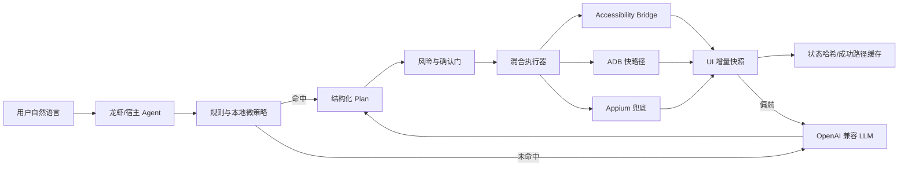

# Semantic Mobile Agent

面向龙虾、MCP Agent、工作流平台和自建 LLM 的 Android 语义控制子 Agent。

它把人的自然语言转换为严格的结构化动作计划，并通过 **手机侧 Accessibility Bridge → ADB 快路径 → Appium UiAutomator2 兜底** 执行。大模型只负责首次理解、复杂页面决策和偏航恢复；重复页面优先走确定性微策略、UI 状态哈希与 SQLite 成功路径缓存。

> 当前版本是可运行的工程化 MVP。它已经具备完整控制闭环和扩展骨架，但“任意版本、任意地区、任意账号状态下覆盖 500 个 App”不可能靠一份静态选择器表一次性保证。项目采用动态发现 + 通用无障碍语义选择器 + 高频 App 适配包 + 成功路径学习的方式逐步扩展。

## 关键目标

- 自然语言 → JSON `Plan` → 可审计 `Action` → 执行结果。
- 单次复杂任务通常只规划一次；界面正常时不重复调用 LLM。
- 已缓存页面和手机侧 Bridge 的动作下发目标为 200–500ms；完整任务时延仍受 App 渲染、网络和 LLM 首次规划影响。
- 设备识别由宿主完成：传入 `emulator-5554`、`10.0.0.8:5555` 或宿主已解析的 Appium 地址。
- 支付、下单、最终叫车、发送消息、拨号、发布和删除等不可逆动作默认暂停确认。
- 不读取或代填密码、短信验证码、支付口令，不绕过 CAPTCHA、风控或 App 安全机制。

## 架构



## 当前能力

确定性微策略已覆盖：

- 打开已安装应用。
- App 内搜索。
- 高德/百度地图类导航。
- 美团、滴滴、高德等打车流程准备，并在最终呼叫前暂停。
- 美团/饿了么类外卖入口和餐品搜索，不自动下单。
- 微信、QQ、钉钉、飞书等消息流程准备，并在发送前暂停。
- 通用点击、文本输入、滑动、按键、断言、Deep Link 和等待。

内置种子适配包包含 30 多个高频应用的名称、别名、包名候选和入口语义。启动后通过 Bridge 读取手机全部 Launcher 应用并合并到注册表，未知 App 仍可使用通用规划器控制。

## 快速启动

```bash
cd semantic-mobile-agent
python -m venv .venv
source .venv/bin/activate
pip install -e '.[all]'
cp .env.example .env
mobile-agent-api
```

只使用规则和 Appium/ADB 时可以不配置 LLM。复杂任意界面需要配置任意 OpenAI 兼容模型：

```dotenv
MOBILE_AGENT_LLM_BASE_URL=http://127.0.0.1:18080/v1
MOBILE_AGENT_LLM_MODEL=Qwen3.8-27B
MOBILE_AGENT_LLM_API_KEY=your-key
```

### 手机侧 Bridge

构建并安装 `android-bridge/`，在系统无障碍设置中启用服务，然后配置令牌。宿主明确传入设备 serial 和本地转发端口：

```bash
adb -s emulator-5554 forward tcp:27183 localabstract:semantic_mobile_agent
```

Bridge 不可用时，执行器自动降级到 ADB 或 Appium。

### 创建任务

```bash
curl -sS http://127.0.0.1:8080/v1/tasks \
  -H 'Content-Type: application/json' \
  -d '{
    "instruction": "使用美团打车去首都机场",
    "device": {
      "serial": "emulator-5554",
      "bridge_port": 27183,
      "bridge_token": "replace-with-phone-token",
      "appium_url": "http://127.0.0.1:4723"
    },
    "context": {},
    "idempotency_key": "ride-demo-001"
  }'
```

轮询 `GET /v1/tasks/TASK_ID`。状态变为 `awaiting_confirmation` 时，先向用户展示 `pending_action`，再提交：

```bash
curl -sS http://127.0.0.1:8080/v1/tasks/TASK_ID/confirm \
  -H 'Content-Type: application/json' \
  -d '{"approved": true, "note": "用户确认呼叫车辆"}'
```

## 龙虾 / MCP 接入

项目提供三种接法：

1. `longxia/SKILL.md`：宿主 Skill 指令和确认协议。
2. `longxia/tool.schema.json`：OpenAI Function Calling 风格工具定义。
3. `mobile-agent-mcp`：MCP stdio server，提供 `mobile_plan`、`mobile_execute`、`mobile_task_status`、`mobile_confirm`、`mobile_cancel`。

```bash
export MOBILE_AGENT_API_URL=http://127.0.0.1:8080
export MOBILE_AGENT_API_TOKEN=optional-token
mobile-agent-mcp
```

设备发现、云机分配、ADB 地址纠正和端口租约由龙虾宿主负责；子 Agent 不自行选择其他设备，避免串机。

## API

| 方法 | 路径 | 用途 |
|---|---|---|
| `GET` | `/healthz` | 健康检查 |
| `POST` | `/v1/plan` | 只生成计划，不执行 |
| `POST` | `/v1/tasks` | 创建异步任务 |
| `GET` | `/v1/tasks/{id}` | 查询状态和动作结果 |
| `POST` | `/v1/tasks/{id}/confirm` | 确认或拒绝待执行动作 |
| `POST` | `/v1/tasks/{id}/cancel` | 取消任务 |
| `GET` | `/v1/apps` | 查看种子与动态应用注册表 |
| `POST` | `/v1/apps/refresh` | 从指定手机刷新 Launcher 应用 |
| `GET` | `/v1/cache/stats` | 成功路径缓存统计 |

设置 `MOBILE_AGENT_API_TOKEN` 后，除健康检查外请求需携带 `Authorization: Bearer ...`。

## 200–500ms 如何实现

这个指标只针对**已建立会话后的动作下发与确认响应**，不能等同于完整打车、外卖或登录流程：

- Bridge 保持长连接，使用 NDJSON 协议。
- UI 快照在手机 Accessibility 树内生成，不重复传完整截图给大模型。
- 选择器在本地评分，优先资源 ID、文本、描述和可点击性。
- 同一指令 + App + UI 状态的成功计划写入 SQLite，达到成功阈值后绕过 LLM。
- 只有选择器失败、页面状态偏离或规则无法覆盖时才重新规划。

```bash
mobile-agent-bench --serial emulator-5554 --port 27183 --samples 100
```

必须以目标云机、网络和 App 版本的 p50/p95 实测为准。

## 目录

```text
src/mobile_agent/
  api.py          REST API
  planner.py      规则、LLM、偏航重规划
  device.py       Bridge、ADB、Appium 混合执行
  ui.py           UI 压缩、状态哈希、选择器评分
  runtime.py      任务状态机、确认、恢复
  risk.py         不可逆动作策略
  cache.py        SQLite 成功路径缓存
  apps.py         动态应用注册表
android-bridge/   手机侧无网络 Accessibility Bridge
longxia/          龙虾 Skill、MCP 与工具协议
```

## 生产边界

上线前至少需要在目标 Android 版本、目标分辨率、目标地区 App 和真实测试账号上跑回归集。涉及交易的业务还需要业务侧风控、用户确认记录、审计日志、幂等键和人工接管。当前代码不会尝试规避登录、验证码、支付确认、平台风控或反自动化策略。
