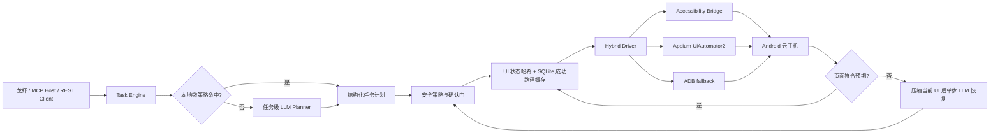

# Semantic Mobile Agent

面向龙虾、MCP Host 和其他 Agent 编排器的 Android 语义控制子 Agent。

它把人的自然语言目标转换为结构化动作计划，再通过 **Accessibility Bridge、Appium UiAutomator2 和 ADB** 的混合执行层控制模拟器、云手机或通过网络 ADB 接入的 Android 设备。

> 本项目不会声称“为 500 个 App 各写了一套永远有效的固定坐标脚本”。实际方案是：启动时发现设备上的全部 Launcher 应用，使用通用 UI 语义执行器覆盖大多数标准 Android 页面，再对美团打车、地图导航、应用内搜索、消息发送和外卖入口等高频流程使用确定性微策略。复杂 WebView、Canvas、自绘控件、验证码和版本差异仍需要持续适配。

## 核心目标

- 人类文字描述 → 类型化 `TaskPlan` / `PrimitiveAction`。
- 高频任务优先走本地规则，不为每一个点击重新请求大模型。
- 同一目标、同一 App、同一 UI 状态复用已验证成功动作。
- 页面偏离时只把压缩后的当前 UI 和错误交给 LLM，请求一个下一步动作。
- 指定设备执行；支持 `emulator-5554`、常见误写 `emul-5554` 和 `host:port`。
- 付款、最终下单、最终叫车、发消息、删除、发布、授权等操作默认停在确认点。
- 动作触发路径以 200–500 ms 为工程目标，而不是虚构整个复杂任务在 500 ms 内完成。

## 性能口径

200–500 ms 指的是以下条件下的**单个已规划动作下发**：

1. Python 服务常驻；
2. ADB/Appium/Bridge 会话已建立；
3. 当前 UI 快照可从 Bridge 或短 TTL 缓存获得；
4. 当前步骤不需要首次 LLM 规划；
5. 手机和宿主机处于可接受的网络与负载状态。

首次任务理解、远程 LLM 往返、App 冷启动、页面网络请求、验证码、动画和第三方服务响应时间不属于这个数字。项目会在每个 `ActionResult` 中记录真实 `latency_ms`，应以你的云手机集群实测 P50/P95 为准。

## 架构



### 为什么不是每步都调用 LLM

如果每一次点击都把截图、完整 UI XML、历史对话和任务说明重新发给大模型，延迟、Token 和误差都会累积。本项目采用四层减负：

1. **微策略编译**：常见意图直接生成语义动作；
2. **任务级计划**：新颖任务只规划一次；
3. **成功路径缓存**：按 `goal + package + state_hash` 复用下一步；
4. **单步恢复**：只有失败或页面偏离才发送压缩 UI，请求一个动作。

系统不保存或要求模型输出隐藏思维链，只保存可审计的计划、动作、结果和状态事件。

## 已实现能力

### 通用动作

- 打开已安装应用；
- 按文字、包含文字、resource-id、content-description、角色、节点路径或语义定位；
- 点击、坐标点击、中文输入、滑动、按键、等待、断言和结束；
- UI 树压缩、状态哈希、重复动作检测；
- 每台设备串行执行，避免两个任务互相抢页面；
- 失败后有限次数单步重规划；
- 异步任务、状态查询、取消、确认后续跑。

### 高频微策略

当前确定性策略覆盖：

- 打开应用；
- 美团、滴滴、高德等应用中的打车入口与目的地输入；
- 地图搜索与导航；
- 应用内搜索；
- 消息联系人搜索、正文输入和发送确认；
- 外卖入口与商品/商家搜索。

示例：

```text
使用美团打车去首都机场
打开高德地图导航到上海虹桥站
在淘宝搜索 2TB 固态硬盘
用微信给张三发消息：晚上七点见
打开美团搜索川菜外卖
```

### App 覆盖方式

`config/apps.yaml` 只是一份高频 App 加速种子，包含美团、滴滴、高德、微信、支付宝、淘宝、京东、抖音、飞书、钉钉、携程、Uber、WhatsApp 等常用应用。

真正的覆盖上限来自 Android Bridge 的 `installed_apps`：服务启动任务时读取设备上的 Launcher 应用标签和包名并合并到注册表。因此“Top 500”不要求维护一份容易过期的 500 包名静态表。标准原生 UI 可直接使用通用语义控制；特殊 App 应通过新增微策略或适配器提高稳定性。

## 目录

```text
semantic-mobile-agent/
├── src/semantic_mobile_agent/
│   ├── api.py              # FastAPI REST 服务
│   ├── mcp_server.py       # 龙虾可调用的 MCP stdio 服务
│   ├── planner.py          # 微策略 + 可选 LLM Planner
│   ├── engine.py           # 任务状态机、恢复、确认
│   ├── drivers.py          # Bridge / Appium / ADB 混合驱动
│   ├── ui.py               # UI 解析、压缩、语义定位
│   ├── safety.py           # 确定性风险升级
│   ├── cache.py            # SQLite 成功路径缓存
│   ├── device.py           # 设备发现与别名纠错
│   └── apps.py             # 动态应用注册表
├── android-bridge/         # 无 INTERNET 权限的 Accessibility Bridge APK 源码
├── config/apps.yaml
├── config/safety.yaml
├── examples/lobster-tool.json
├── tests/
├── Dockerfile
└── docker-compose.yml
```

## 快速开始

### 1. 环境

最低要求：

- Python 3.11+
- Android Platform Tools，`adb` 可执行
- 一台已授权的 Android 模拟器、云手机或测试设备

可选：

- Appium Server 与 UiAutomator2 Driver
- 本项目 Android Accessibility Bridge
- 任意 OpenAI 兼容 LLM Endpoint

### 2. 安装

```bash
cd semantic-mobile-agent
python -m venv .venv
source .venv/bin/activate
python -m pip install --upgrade pip
python -m pip install -e '.[dev]'
cp .env.example .env
```

只使用本地微策略时可以不配置 LLM。新颖任务需要设置：

```dotenv
SMA_LLM_BASE_URL=https://your-openai-compatible-endpoint/v1
SMA_LLM_API_KEY=replace-me
SMA_LLM_MODEL=your-model
```

### 3. 查看设备

```bash
adb devices -l
```

只有一台设备时可省略 `device`。多台设备时必须显式指定，服务不会随机挑选：

```dotenv
SMA_DEFAULT_DEVICE=emulator-5554
```

设备参数支持：

```text
emulator-5554
emul-5554              # 自动纠正为 emulator-5554
10.0.0.8:5555          # 自动执行 adb connect
adb://10.0.0.8:5555
```

### 4. 启动 REST 服务

```bash
semantic-mobile-agent
```

默认监听 `0.0.0.0:8787`：

```bash
curl http://127.0.0.1:8787/healthz
curl http://127.0.0.1:8787/v1/devices
```

### 5. 先预览计划

```bash
curl -sS http://127.0.0.1:8787/v1/plan \
  -H 'Content-Type: application/json' \
  -d '{
    "instruction": "使用美团打车去首都机场",
    "dry_run": true
  }'
```

### 6. 执行任务

同步等待一段时间：

```bash
curl -sS http://127.0.0.1:8787/v1/execute \
  -H 'Content-Type: application/json' \
  -d '{
    "instruction": "使用美团打车去首都机场",
    "device": "emul-5554",
    "timeout_s": 60
  }'
```

也可创建异步任务：

```bash
curl -sS http://127.0.0.1:8787/v1/tasks \
  -H 'Content-Type: application/json' \
  -d '{
    "instruction": "使用美团打车去首都机场",
    "device": "emulator-5554"
  }'
```

查询状态：

```bash
curl http://127.0.0.1:8787/v1/tasks/TASK_ID
```

最终叫车步骤会返回：

```json
{
  "status": "waiting_confirmation",
  "pending_action": {
    "kind": "click",
    "risk": "critical",
    "confirmation_message": "已准备好使用美团叫车去‘首都机场’，是否执行最终叫车操作？"
  }
}
```

批准或拒绝：

```bash
curl -sS http://127.0.0.1:8787/v1/tasks/TASK_ID/confirm \
  -H 'Content-Type: application/json' \
  -d '{"approved": true, "note": "用户已确认目的地和车型"}'
```

## 龙虾 / MCP 接入

启动 stdio MCP Server：

```bash
semantic-mobile-mcp
```

工具：

- `mobile_execute`
- `mobile_plan`
- `mobile_task_status`
- `mobile_confirm`
- `mobile_devices`

`examples/lobster-tool.json` 提供了接入示例。父 Agent 负责把它掌握的设备地址传给 `device`；子 Agent 负责纠正常见序列号格式、建立 ADB 连接并控制对应手机。

推荐父 Agent 调用流程：

1. 必要时调用 `mobile_devices`；
2. 调用 `mobile_execute`；
3. 返回 `waiting_confirmation` 时，把 `pending_action.confirmation_message` 原样展示给用户；
4. 用户明确同意后调用 `mobile_confirm`；
5. 用 `mobile_task_status` 获取最终结果。

## Android Accessibility Bridge

Bridge 是达到低延迟和可靠中文输入的推荐路径。它：

- 不申请 `INTERNET` 权限；
- 使用本机抽象套接字；
- 由 Python 端按设备建立 `adb forward`；
- 保持长连接，避免每步启动新进程；
- 直接输出精简的节点属性和稳定的当前快照路径；
- 支持可选令牌。

构建和启用步骤见 [`android-bridge/README.md`](android-bridge/README.md)。启用后保持：

```dotenv
SMA_BRIDGE_ENABLED=true
SMA_BRIDGE_SOCKET=semantic_mobile_agent
SMA_BRIDGE_TOKEN=与你写入设备的令牌一致
```

## Appium 配置

Bridge 不可用时，服务会尝试持久 Appium UiAutomator2 会话，再回退到原始 ADB。

典型 Appium Server：

```bash
appium driver install uiautomator2
appium --address 0.0.0.0 --port 4723
```

配置：

```dotenv
SMA_APPIUM_ENABLED=true
SMA_APPIUM_URL=http://127.0.0.1:4723
```

Appium 主要负责 UI XML 和复杂输入兜底；普通点击最终会落为当前节点中心点或 Bridge 节点动作，不重复创建 Session。

## 动作协议

计划只包含可执行、可审计的动作，不包含模型思维过程：

```json
{
  "goal": "使用美团打车去首都机场",
  "intent": "ride_hailing",
  "app": "美团",
  "package": "com.sankuai.meituan",
  "steps": [
    {
      "kind": "open_app",
      "package": "com.sankuai.meituan",
      "risk": "low"
    },
    {
      "kind": "click",
      "locator": {
        "strategy": "semantic",
        "value": "打车",
        "alternatives": ["打车出行", "叫车"]
      },
      "risk": "low"
    },
    {
      "kind": "set_text",
      "locator": {
        "strategy": "semantic",
        "value": "目的地输入框"
      },
      "text": "首都机场",
      "risk": "medium"
    },
    {
      "kind": "click",
      "locator": {
        "strategy": "semantic",
        "value": "立即叫车"
      },
      "risk": "critical",
      "confirmation_message": "是否执行最终叫车操作？"
    }
  ]
}
```

支持的定位方式：

- `semantic`
- `text`
- `text_contains`
- `resource_id`
- `description`
- `role`
- `path`
- `focused`

固定坐标 `tap` 只作为最后手段，不应成为常规 App 适配方式。

## 安全策略

`config/safety.yaml` 在模型之外独立判断风险。模型可以把风险标高，但不能把命中确定性规则的风险标低。

默认必须确认：

- 支付、转账、提现、交易；
- 提交订单、立即购买；
- 最终叫车；
- 发送消息、发布内容；
- 删除、清空、注销；
- 授权、确认预约、修改账号安全信息。

`SMA_ALLOW_UNSAFE=true` 会跳过全部确认门，只应在隔离测试设备和测试账号中使用。生产环境不建议配置。

## Docker

容器使用宿主机 ADB Server，因此 Compose 默认采用 host network：

```bash
cp .env.example .env
docker compose up --build
```

宿主机先确认：

```bash
adb devices -l
```

远程 Docker、非 Linux Docker Desktop 或不允许 host networking 的环境，需要把 ADB Server 暴露到容器可达地址，并调整 `ADB_SERVER_SOCKET`。

## 测试

```bash
make install
make lint
make test
```

测试覆盖：

- `emul-5554` 别名纠错；
- UI XML 解析与语义节点排序；
- 美团打车结构化计划和最终确认门；
- 动态 App 注册；
- 支付等风险的确定性升级；
- SQLite 动作缓存；
- 无手机环境的 dry-run。

真实设备稳定性需要在你的目标云手机、系统版本和 App 版本矩阵上跑集成测试。仓库中的单元测试不能替代美团、滴滴等线上 App 的持续回归。

## 已知限制

- 无障碍 UI 树看不到的 Canvas、游戏、自绘图层需要视觉定位扩展；
- WebView 是否暴露节点取决于 App 和 WebView 配置；
- 验证码、滑块、人脸、支付密码等必须交给用户，不应自动绕过；
- Android 权限弹窗、系统 ROM 差异和厂商安全控件需要设备矩阵验证；
- App 更新会改变文案和结构，通用语义定位能降低但不能消除维护成本；
- 当前内置的“本地小模块”是确定性微策略与路径缓存，不是随仓库分发的神经网络权重；后续可在 Planner 前增加 ONNX/TFLite 意图分类器，但不能替代 UI 实际状态验证；
- 任务状态当前常驻内存，成功路径缓存落 SQLite；服务重启后历史任务不会恢复，生产集群可把任务存储替换为 Redis/PostgreSQL。

## 许可证

Apache License 2.0。仅在你拥有或明确获准控制的设备和账号上使用，并遵守目标 App 的条款及所在地法律。
