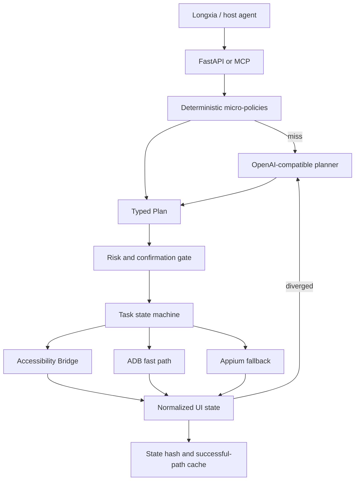

# Architecture

## Design principle

The system separates a **slow semantic loop** from a **fast control loop**.

The slow loop runs only when a task is new, ambiguous, or the screen diverges from the expected state. It compiles natural language and a compressed UI snapshot into a typed `Plan`. The fast loop keeps a device session warm and dispatches already compiled actions without asking the LLM to rediscover the workflow at every tap.

## Components

### Host boundary

The host owns user identity, cloud-phone allocation, device lease, ADB serial/address resolution, location/contact disambiguation, and the visible confirmation UI. The mobile agent never chooses a different device from an ADB device list.

### Planner

`RulePlanner` handles high-frequency intents with low token cost: open, search, navigation, ride preparation, food search, and message preparation. `LLMPlanner` handles arbitrary UI tasks and receives only the final instruction, necessary host context, a compact app catalog, and at most the current compressed UI state.

Plans use a strict Pydantic schema. The service never executes free-form shell commands emitted by a model.

### Runtime

`TaskRunner` implements queued, planning, running, awaiting-confirmation, succeeded, failed, and cancelled states. It provides idempotency, bounded steps, retries, bounded replans, action results, and exact confirmation resumption.

### Execution backends

1. **Accessibility Bridge**: persistent local socket, semantic nodes, Unicode input, gestures, Launcher discovery.
2. **ADB**: app launch, deep links, key events, coordinates, basic UIAutomator XML fallback.
3. **Appium UiAutomator2**: full automation fallback when Bridge/ADB cannot perform an operation.

Backend failure does not silently change the target device because every client is keyed by the host-provided serial.

### UI representation

The system converts Appium XML or Accessibility nodes into one common `UiSnapshot`. A stable hash is derived from visible semantic properties and quantized bounds. The LLM sees a ranked, size-bounded representation rather than a screenshot or full XML dump for every step.

### Cache

A cache key combines normalized instruction, app, and initial UI state. A path becomes reusable only after a configurable number of successes and no recorded failure. Failed cached workflows are not silently retried forever; they return to the planner.

## Scaling beyond seed applications

The project does not claim that a static selector file can guarantee every version of 500 applications. Coverage scales through four layers:

1. Runtime discovery of every installed Launcher application.
2. Generic semantic selectors based on text, description, resource ID, class, editability, and clickability.
3. Seed profiles for common package names, aliases, capabilities, and entry labels.
4. Learned successful paths keyed by real UI state and invalidated by failures.

App-specific adapters should be added only where generic semantics are unstable or the application exposes a safer deep link/API.

## Latency model

`ActionResult.latency_ms` measures backend dispatch and acknowledgement. It intentionally excludes configured post-action wait, application rendering, network calls, and first-pass LLM planning. The 200–500ms objective applies to a warm session and a compiled action, not an end-to-end transaction.
